# ML Language Playground: Multi-Language ML Benchmark

A multi-language machine learning benchmark comparing implementations across C, Rust, and Python. Originally built around two neural network families — MLP and CNN/LeNet-5 — the library has been extended into a broader algorithm zoo covering regression, tree ensembles, sequence forecasting, probabilistic models, and unsupervised learning.

## Model Catalogue

| Family | Models | Languages |
|---|---|---|
| **Classification (NN)** | MLP (1–5 hidden layers), CNN/LeNet-5 | C (CPU+CUDA), Rust (CPU+cuBLAS+CUDA-kernels), NumPy, PyTorch |
| **Regression (linear)** | OLS, Ridge, Lasso, Quantile Regression | C (CPU), Rust (CPU), NumPy, PyTorch |
| **Tree ensembles** | CART, Random Forest, Gradient Boosted Trees | NumPy |
| **Sequence forecasting** | LSTM, GRU, 1D TCN, Transformer encoder, **Temporal Fusion Transformer** | PyTorch |
| **Probabilistic** | Gaussian Process, Hidden Markov Model | NumPy |
| **Unsupervised** | Autoencoder, K-Means, Gaussian Mixture, PCA | PyTorch (autoencoder), NumPy |

All implementations emit a standardised output block (`Test Loss / Test Accuracy / Train time / Eval time / Throughput`) so the benchmark runners can parse them uniformly.

---

## MLP Architecture

| Component | Choice | Rationale |
|-----------|--------|-----------|
| Hidden layers | 1–5 (configurable depth and width) | `--num-hidden-layers N` controls depth; all hidden layers share `--hidden-size` width |
| Hidden activation | ReLU | Fast, avoids vanishing gradients |
| Output activation | Softmax | Produces class probabilities for multi-class classification |
| Loss | Cross-entropy | Standard for classification; clean gradient with softmax |
| Initialization | Xavier uniform (sqrt(2/fan_in)) | Keeps activation variance stable across layers |
| Optimizer | Mini-batch SGD or Adam (configurable) | SGD: simple baseline; Adam: adaptive per-parameter learning rates |
| Scheduler | None or cosine annealing with warmup | Optional cosine decay (5% linear warmup, decay to lr_min=1e-6) |

### MLP Implementations

| Implementation | File | Description |
|---------------|------|-------------|
| C (CPU) | `src/c/models/mlp/mlp_cpu.c` | Manual backprop in C99 with OpenMP and cache-tiled GEMM |
| C (CUDA) | `src/c/models/mlp/mlp.cu` | GPU kernels with cuBLAS GEMM and custom elementwise CUDA kernels |
| Rust (CPU) | `src/rust/models/mlp-cpu/src/main.rs` | Rayon threadpool + cache-tiled GEMM (TILE=64) |
| Rust (cuBLAS) | `src/rust/models/mlp-cuda-cublas/src/main.rs` | cuBLAS FFI for GEMM + custom CUDA kernels |
| Rust (CUDA Kernels) | `src/rust/models/mlp-cuda-kernels/src/main.rs` | All custom CUDA kernels including shared-memory tiled matmul |
| NumPy (CPU) | `src/python/models/mlp/mlp_numpy.py` | Vectorised NumPy, exact replica of the C algorithm |
| PyTorch (CPU/CUDA) | `src/python/models/mlp/mlp_pytorch.py` | `nn.Module` with manual Xavier init |

## CNN Architecture (LeNet-5)

| Component | Choice | Rationale |
|-----------|--------|-----------|
| Conv1 | 1→6 channels, 5×5 kernel | Classic LeNet-5 first layer for edge/texture detection |
| Conv2 | 6→16 channels, 5×5 kernel | Higher-level feature combinations |
| Pooling | 2×2 average pooling (stride 2) | Spatial downsampling, matches LeNet-5 |
| Convolution method | im2col + GEMM | Reuses optimised tiled GEMM |
| FC layers | 256→120→84→10 | LeNet-5 classifier |
| Activations | ReLU (modernised replacement for sigmoid/tanh) | |
| Output | Softmax + Cross-entropy | |

### CNN Implementations

10 variants spanning the same C/Rust/PyTorch matrix as MLP, plus three cuDNN backends. See `src/c/models/cnn/`, `src/rust/models/cnn-*/`, and `src/python/models/cnn/`.

---

## Regression Models

A regression family built around linear models, tree ensembles, and a Gaussian Process. All accept the same dataset names and standardised CLI flags as the classification models, with `Test Accuracy` overloaded to a model-appropriate score: R² for point regressors, P10/P90 interval coverage for quantile/probabilistic models, explained-variance ratio for PCA, and cluster balance for K-means/GMM.

### Linear / Ridge / Lasso

| Implementation | File | Solver |
|---|---|---|
| C (CPU) | `src/c/models/regression/regression_cpu.c` | Cholesky on normal equations / coordinate descent for Lasso |
| Rust (CPU) | `src/rust/models/regression-cpu/src/main.rs` | Same algorithms, parallel inner loops via Rayon |
| NumPy | `src/python/models/regression/linear_numpy.py` | `np.linalg.solve` / coordinate descent |
| PyTorch (CPU/CUDA) | `src/python/models/regression/linear_pytorch.py` | `torch.linalg.solve` / ISTA proximal gradient |

```bash
# OLS (no regularisation)
python3 src/python/models/regression/linear_numpy.py --dataset synthetic-linear

# Ridge with closed-form solve
python3 src/python/models/regression/linear_numpy.py --dataset synthetic-linear --regularizer l2 --lambda-reg 0.5

# Lasso with coordinate descent — recovers sparse coefficients
python3 src/python/models/regression/linear_numpy.py --dataset synthetic-linear --regularizer l1 --lambda-reg 0.05

# Same in C
LD_LIBRARY_PATH=src/c/build_cpu:src/c/build_cpu/models/regression \
    ./src/c/build_cpu/regression_main --regularizer l1 --lambda-reg 0.05

# Same in Rust
./src/rust/target/release/regression-cpu --regularizer l1 --lambda-reg 0.05
```

### Quantile Regression

Independent linear models trained jointly with the pinball loss across multiple quantiles (P10/P50/P90 by default). Output is the full vector of quantile predictions, and the reported "accuracy" is the empirical coverage of the P10–P90 interval.

```bash
python3 src/python/models/regression/quantile_numpy.py --dataset synthetic-nonlinear --quantiles 0.1,0.5,0.9
```

### Tree Ensembles

| Model | File | Notes |
|---|---|---|
| Decision Tree | `src/python/models/trees/decision_tree_numpy.py` | Pure-NumPy CART with weighted splits |
| Random Forest | `src/python/models/trees/random_forest_numpy.py` | Bagging + per-split feature subsampling |
| Gradient Boosted Trees | `src/python/models/trees/gbm_numpy.py` | Stochastic GBM, MSE or pinball loss |

The tree primitive (`_tree_core.py`) is shared between Random Forest and GBT, so improvements to the splitter benefit both.

```bash
python3 src/python/models/trees/decision_tree_numpy.py --dataset synthetic-nonlinear --max-depth 8
python3 src/python/models/trees/random_forest_numpy.py --dataset synthetic-nonlinear --n-estimators 50 --max-depth 10
python3 src/python/models/trees/gbm_numpy.py --dataset synthetic-nonlinear --n-estimators 100 --max-depth 3 --learning-rate 0.05

# Quantile-loss boosting for prediction intervals (P10 example)
python3 src/python/models/trees/gbm_numpy.py --dataset synthetic-nonlinear --loss quantile --quantile 0.1
```

### Gaussian Process Regression

RBF + white-noise kernel with hyperparameters fit by maximising the log marginal likelihood. The closed-form posterior gives both a mean prediction and a calibrated variance — the reported accuracy is the empirical 95% interval coverage.

```bash
python3 src/python/models/gp/gp_numpy.py --dataset synthetic-nonlinear --num-samples 512
```

GP scales as O(n³) in the number of training points, so training is internally capped at 1024 samples — appropriate for benchmarking, not for production.

---

## Sequence Models

Five forecasting architectures with a shared input/output contract: the input is a `(batch, seq_len, num_features)` tensor and the output is a horizon vector of length `H` (or a `(B, H, Q)` cube of quantile predictions for the TFT). They train on synthetic multivariate datasets generated by `src/python/utils/data_utils.py::load_sequence_dataset`.

### LSTM / GRU

```bash
python3 src/python/models/rnn/lstm_pytorch.py --dataset synthetic-multivar --device cpu
python3 src/python/models/rnn/gru_pytorch.py  --dataset synthetic-multivar --device cuda
```

Both take the final hidden state of an encoder RNN and project it to a flat horizon vector. `--num-layers` and `--hidden-size` control capacity; the GRU uses ~25% fewer parameters than the equivalent LSTM.

### 1D Temporal Convolutional Network

Causal dilated 1D convolutions stacked into residual blocks. Receptive field grows exponentially in depth — for kernel size `k` and `L` blocks, the effective receptive field is `1 + 2(k-1)(2^L - 1)`.

```bash
python3 src/python/models/tcn/tcn_pytorch.py --dataset synthetic-multivar --num-blocks 4 --kernel-size 3
```

### Transformer Encoder

Pre-norm encoder-only Transformer with sinusoidal positional encoding. Multi-head self-attention over the input window, mean pooling, then a linear head to the horizon.

```bash
python3 src/python/models/transformer/transformer_pytorch.py --dataset synthetic-multivar --d-model 64 --n-heads 4 --num-layers 2
```

### Temporal Fusion Transformer (TFT)

A faithful implementation of Lim et al.'s TFT, with all the original architectural components:

- **Variable Selection Networks (VSN)** — a per-feature Gated Residual Network produces a hidden embedding for each input variable, and a second GRN over the concatenated embeddings produces a softmax weight per variable. The output is a weighted sum, and the weights are interpretable as variable importances.
- **Static covariate encoders** — four separate GRNs map a static feature vector into four context vectors that condition variable selection (`c_vs`), static enrichment (`c_e`), and the LSTM initial hidden/cell states (`c_h`, `c_c`).
- **Locality-aware sequence layer** — an LSTM encoder runs over the past window, and an LSTM decoder runs over the known-future window, both initialised from the static contexts. Outputs are gated and residual-summed with the variable-selected embeddings.
- **Static enrichment GRN** — broadcasts `c_e` across the time axis to inject static information into every timestep before attention.
- **Interpretable multi-head attention** — multi-head queries and keys with a single shared value projection. This makes head-averaged attention weights interpretable as importance per timestep.
- **Position-wise feed-forward GRN + final gated residual** before output.
- **Quantile output head** — a single linear projection to `Q` quantiles per horizon step. Trained with the pinball loss; reported metric is the empirical interval coverage.

The synthetic datasets here don't ship with explicit static or known-future fields, so the TFT script auto-derives them: past = full window, future = non-target features (assumed forecastable), static = `(target_mean, target_std)` over the past window. Real deployments would replace those with actual forecasts and metadata.

```bash
python3 src/python/models/tft/tft_pytorch.py --dataset synthetic-load --device cuda \
    --hidden-size 64 --n-heads 4 --quantiles 0.1,0.5,0.9 --epochs 50
```

#### Why TFT is in the library

TFT combines four otherwise-separate ideas under one roof:

- **Multi-horizon quantile output**, which gives prediction intervals for any timestep.
- **Static covariate handling**, which lets the model condition on slow-moving metadata.
- **Variable selection**, which acts as built-in feature importance and learned regularisation.
- **Interpretable attention**, which surfaces which historical timesteps drove a given prediction.

Each of those is useful on its own; the TFT implementation here demonstrates all four working together on the same model graph.

---

## Probabilistic / Unsupervised

| Model | File | Notes |
|---|---|---|
| HMM | `src/python/models/hmm/hmm_numpy.py` | Gaussian emissions, Baum–Welch training, Viterbi decoding |
| Autoencoder | `src/python/models/autoencoder/autoencoder_pytorch.py` | Symmetric MLP autoencoder for sequence-window reconstruction |
| K-Means | `src/python/models/clustering/kmeans_numpy.py` | k-means++ initialisation |
| GMM | `src/python/models/clustering/gmm_numpy.py` | Diagonal-covariance EM |
| PCA | `src/python/models/pca/pca_numpy.py` | Thin SVD |

```bash
# Discrete regime detection on a regime-switching synthetic series
python3 src/python/models/hmm/hmm_numpy.py --dataset synthetic-regime --num-states 2

# Anomaly detection via reconstruction error
python3 src/python/models/autoencoder/autoencoder_pytorch.py --dataset synthetic-load

# Clustering and dimensionality reduction
python3 src/python/models/clustering/kmeans_numpy.py --dataset synthetic-nonlinear --num-clusters 4
python3 src/python/models/clustering/gmm_numpy.py    --dataset synthetic-nonlinear --num-clusters 4
python3 src/python/models/pca/pca_numpy.py           --dataset synthetic-linear --num-components 4
```

---

## Datasets

### Classification

| Name | Samples | Features | Classes | Source |
|------|---------|----------|---------|--------|
| `generated` | configurable (default 1000) | 2 | 2 | Synthetic 2D circle |
| `iris` | 150 | 4 | 3 | UCI Iris |
| `wine-red` | 1599 | 11 | 11 | UCI Wine Quality (red) |
| `wine-white` | 4898 | 11 | 11 | UCI Wine Quality (white) |
| `breast-cancer` | 569 | 30 | 2 | Wisconsin Diagnostic |
| `mnist` | 70,000 | 784 (28×28) | 10 | Handwritten digits |

### Regression

| Name | Samples | Features | Notes |
|------|---------|----------|-------|
| `synthetic-linear` | configurable (default 4096) | 20 (5 informative) | Sparse ground-truth coefficients — good Lasso target |
| `synthetic-nonlinear` | configurable (default 4096) | 10 | Friedman-1 style; tree models and kernels beat linear |
| `california-housing` | 20640 | 8 | UCI California housing prices |
| `wine-quality-reg` | 1599 | 11 | Wine quality treated as continuous |
| `concrete` | 1030 | 8 | UCI concrete compressive strength |

### Sequence

All sequence datasets are synthetic and generated on the fly. Each call returns `(num_windows, seq_len, num_features)` input tensors and `(num_windows, horizon)` targets.

| Name | Channels | Description |
|------|----------|-------------|
| `synthetic-sine` | 1 | Single noisy sine wave |
| `synthetic-multivar` | 4 | Daily/weekly seasonality + AR(1) target with three exogenous drivers |
| `synthetic-regime` | 1 | Two-regime AR series with low-vol and high-vol-with-spikes states |
| `synthetic-load` | 7 | Hourly demand-style curve: double-peak daily, weekday/weekend modulation, annual heating/cooling, AR component, plus calendar features (sin/cos hour-of-day, sin/cos day-of-week, weekend flag) |

---

## Quick Start

### Prerequisites

- **C**: GCC (C99), CMake 3.10+, OpenMP
- **CUDA**: NVIDIA CUDA Toolkit (for GPU implementations in C and Rust)
- **Rust**: Cargo (2021 edition)
- **Python**: Python 3.8+, NumPy, matplotlib, PyTorch, PyYAML, tqdm

### Build everything

```bash
./build.sh
```

Builds C (CPU + CUDA), Rust (CPU + cuBLAS + CUDA-kernels + regression-cpu), and installs Python dependencies. Targets whose toolchains are missing are skipped with a warning.

### Run the original NN benchmark suite

```bash
# Full pipeline for MLP and CNN: build -> tune -> benchmark -> plot
./run.sh

# Single model
./run.sh --model mlp
./run.sh --model cnn

# Skip retuning if you already have cached params
./run.sh --skip-tune
```

### Run the regression / sequence model suites

The regression and sequence families don't fit cleanly into the GPU-throughput-scaling framework that powers `benchmark.py` (small models, different metrics, different hyperparameter axes), so they have their own driver:

```bash
# Comparison table across the regression family
python3 src/scripts/extras_benchmark.py --family regression

# Comparison table across the sequence family (LSTM, GRU, TCN, Transformer, TFT, ...)
python3 src/scripts/extras_benchmark.py --family sequence

# Both
python3 src/scripts/extras_benchmark.py --family all
```

The driver reads `configs/models/regression.yaml` and `configs/models/sequence.yaml`, runs each implementation that's available locally, parses the standardised output, and emits a markdown comparison table.

---

## MLP Scaling Benchmark Analysis

> The neural-network scaling analysis below is unchanged from the original benchmark; the new model families are characterised in their own runners (`extras_benchmark.py`) since their compute profiles don't share the GPU-saturating GEMM-heavy workload that the MLP/CNN scaling story is built around.

All measurements were collected on an NVIDIA RTX 3070 (46 SMs, 5888 CUDA cores, 8 GB GDDR6) paired with an Intel Core i9-10900F (10 cores, 20 threads, 2.80 GHz). The benchmark sweeps four independent axes — dataset size, mini-batch size, hidden-layer width, and network depth — while holding the others fixed.

### Peak Throughput Summary

| Experiment | C (CUDA) | Rust (cuBLAS) | Rust (Kernels) | PyTorch (CUDA) | C (CPU) | PyTorch (CPU) | NumPy | Rust (CPU) |
|---|---|---|---|---|---|---|---|---|
| Dataset Size | **8.92M** | 8.21M | 5.25M | 3.35M | 1.29M | 1.34M | 769K | 852K |
| Batch Size | 7.21M | **7.21M** | 4.80M | 2.76M | 851K | 883K | 829K | 675K |
| Hidden Size | **9.70M** | 9.15M | 8.75M | 1.80M | 5.96M | 1.58M | 3.89M | 3.21M |
| Network Depth | **6.92M** | 6.69M | 5.76M | 1.83M | 2.13M | 1.51M | 1.64M | 1.39M |

Plots and the full scaling discussion remain in [`results/plots/mlp/`](results/plots/mlp/) and the section below.

### Dataset Size Scaling (8K – 4M samples)

Fixed parameters: `batch_size = 2048`, `hidden_size = 256`, `epochs = 10`.

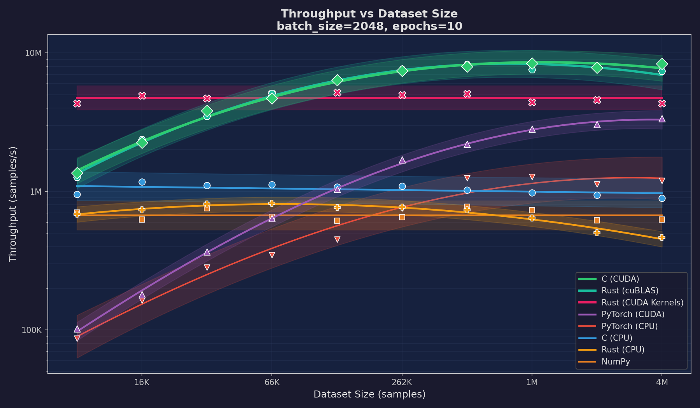

The dataset-size sweep shows GPU throughput rising and plateauing once enough mini-batches amortise kernel-launch overhead. C CUDA and Rust cuBLAS lead at ~9M samples/s, with the custom-kernel build at ~5M and PyTorch CUDA around ~3.3M. CPU implementations cluster between 700K and 1.3M samples/s.

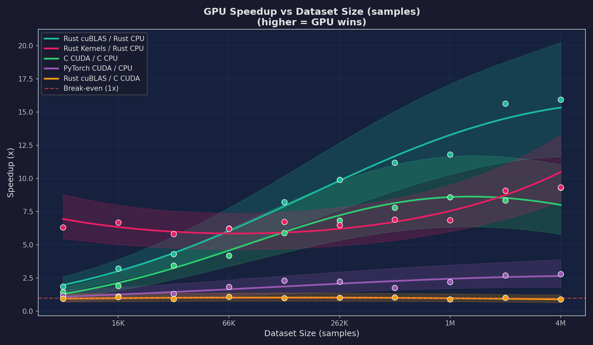

### Batch Size Scaling (256 – 16K)

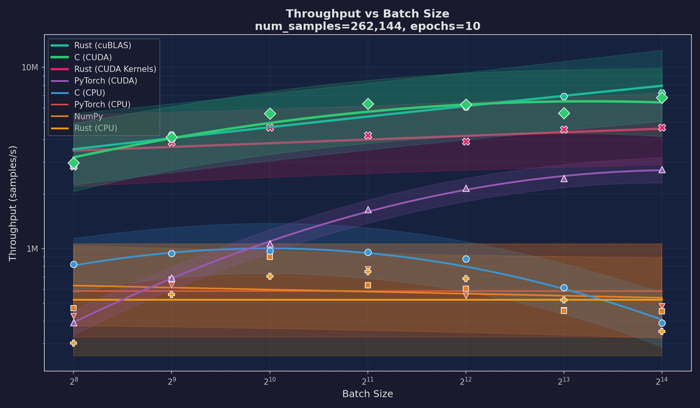
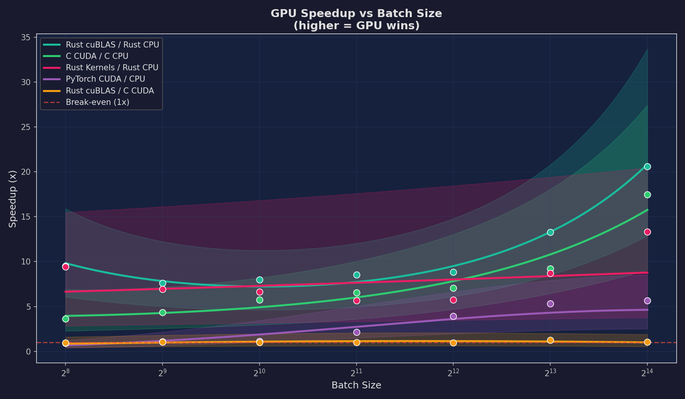

GPU throughput rises monotonically with batch size, reflecting how SM occupancy grows with available data-parallel work.

### Hidden Size Scaling (64 – 8K)

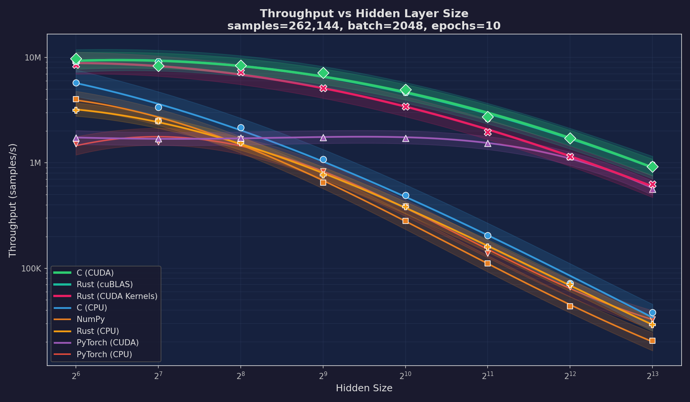
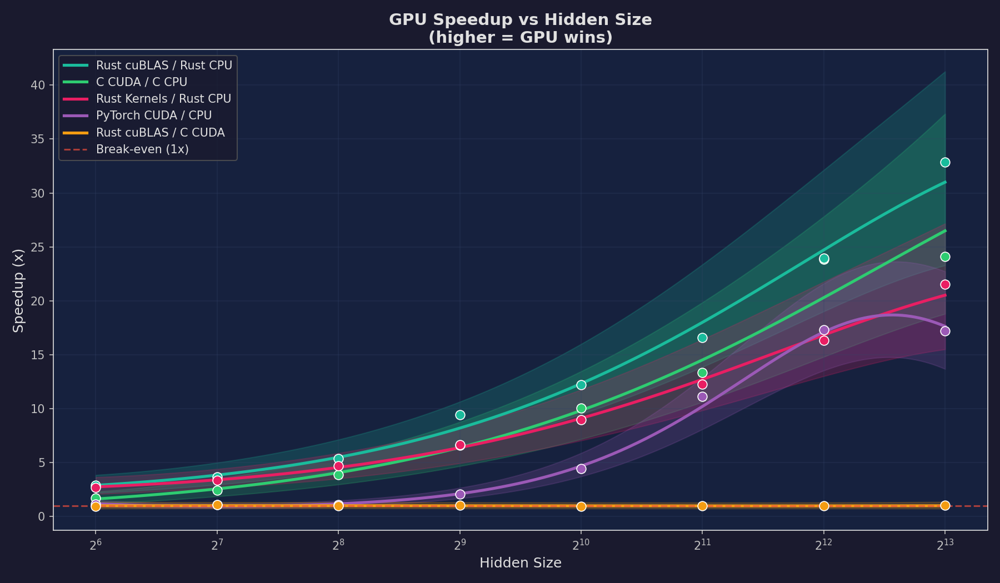

The clearest test of compute-bound vs memory-bound behaviour. CPU implementations suffer once weight matrices outgrow L3, while the GPU degrades gracefully thanks to its on-chip SRAM.

### Network Depth Scaling (1 – 5 hidden layers)

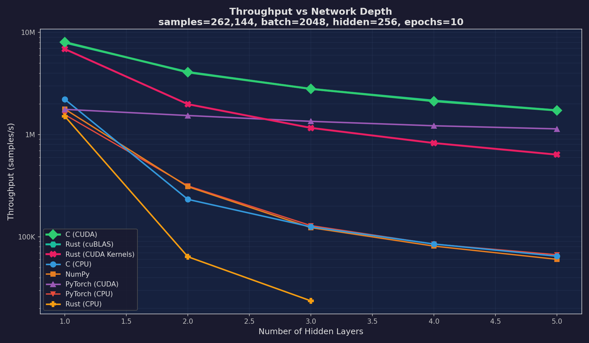
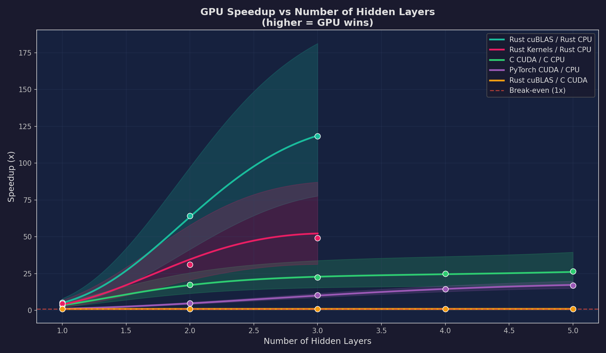

GPUs absorb depth-related overhead almost for free because each per-layer GEMM still fully saturates the SMs; CPU performance falls off steeply once the working set spills out of L3.

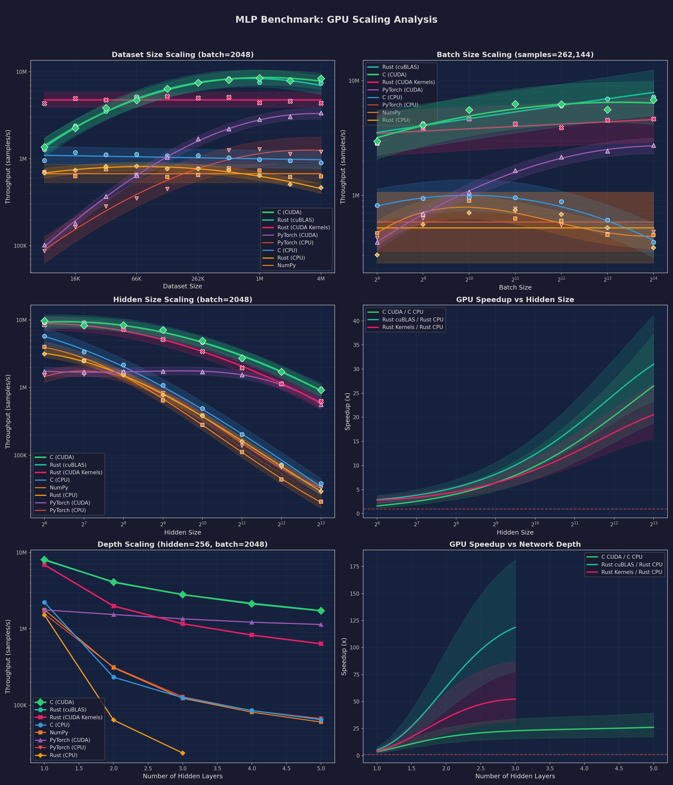

---

## CNN Scaling Benchmark Analysis

LeNet-5 on MNIST, batch size 16 – 1024.

| Implementation | Peak Throughput | Notes |
|---|---|---|
| Rust cuBLAS (cuDNN) | **262K/s** | cuDNN convolution kernels via Rust FFI |
| C (cuDNN) | 260K/s | cuDNN convolution backend |
| Rust Kernels (cuDNN) | 249K/s | cuDNN convolution + custom CUDA FC layers |
| PyTorch (CUDA) | 187K/s | Built-in cuDNN via autograd |
| Rust (cuBLAS) | 152K/s | im2col + cuBLAS GEMM |
| Rust (CUDA Kernels) | 150K/s | im2col + shared-memory tiled matmul |
| C (CUDA) | 150K/s | im2col + cuBLAS GEMM |
| PyTorch (CPU) | 31K/s | CPU convolution via autograd |
| C (CPU) | 15K/s | im2col + OpenMP tiled GEMM |
| Rust (CPU) | 6K/s | im2col + Rayon tiled GEMM |

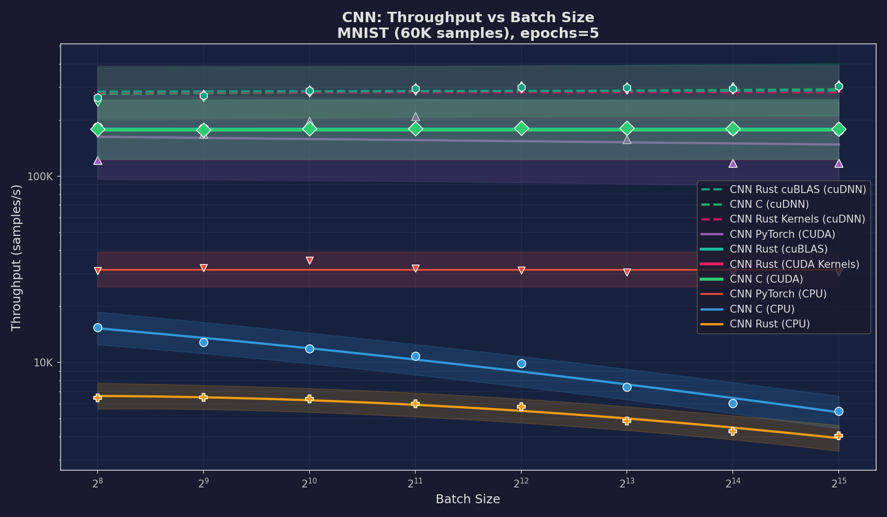
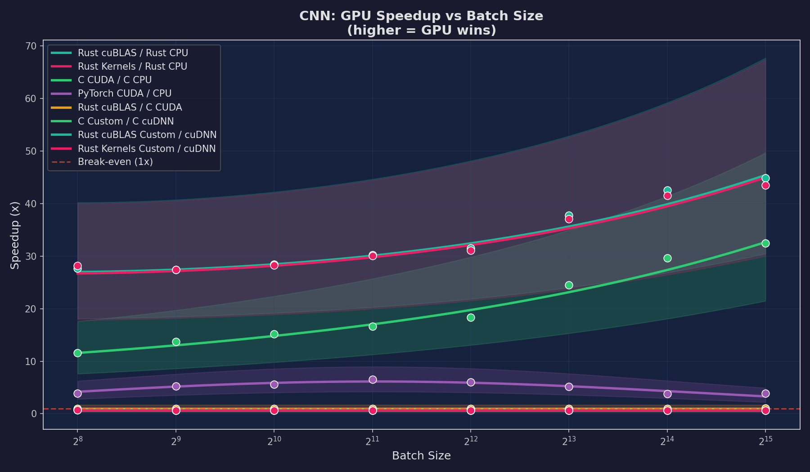
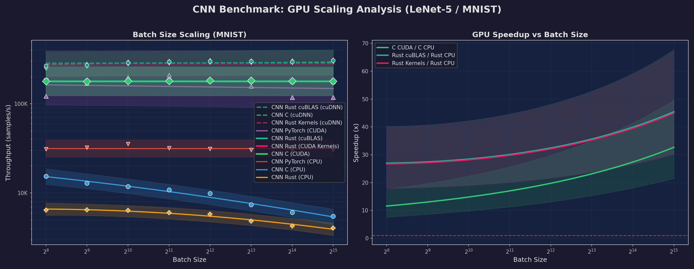

---

## Project Structure

```
ML-in-C/
├── data/                          # Datasets (downloaded via scripts)
├── configs/                       # Layered YAML config (base + per-model)
│   └── models/
│       ├── mlp.yaml
│       ├── cnn.yaml
│       ├── regression.yaml        # NEW: regression family config
│       └── sequence.yaml          # NEW: sequence family config
├── results/
│   ├── plots/mlp/                 # MLP benchmark charts
│   ├── plots/cnn/                 # CNN benchmark charts
│   ├── cache/                     # Benchmark cache (gitignored)
│   └── logs/                      # Benchmark logs (gitignored)
├── src/
│   ├── c/
│   │   ├── CMakeLists.txt
│   │   ├── main.c                 # MLP CLI
│   │   ├── cnn_main.c             # CNN CLI
│   │   ├── regression_main.c      # NEW: regression CLI (self-contained)
│   │   ├── nn_ops/                # Shared NN ops
│   │   └── models/
│   │       ├── mlp/
│   │       ├── cnn/
│   │       └── regression/        # NEW: OLS/ridge/lasso (CPU)
│   ├── rust/
│   │   ├── Cargo.toml
│   │   ├── utils/nn-common/
│   │   └── models/
│   │       ├── mlp-cpu, mlp-cuda-cublas, mlp-cuda-kernels
│   │       ├── cnn-cpu, cnn-cuda-cublas, cnn-cuda-kernels
│   │       └── regression-cpu     # NEW: OLS/ridge/lasso (CPU)
│   ├── python/
│   │   ├── models/
│   │   │   ├── mlp/                       # NumPy + PyTorch MLP
│   │   │   ├── cnn/                       # PyTorch CNN
│   │   │   ├── regression/                # NEW: linear, quantile, PyTorch
│   │   │   ├── trees/                     # NEW: decision tree, RF, GBT
│   │   │   ├── rnn/                       # NEW: LSTM, GRU
│   │   │   ├── tcn/                       # NEW: 1D TCN
│   │   │   ├── transformer/               # NEW: vanilla Transformer encoder
│   │   │   ├── tft/                       # NEW: Temporal Fusion Transformer
│   │   │   ├── gp/                        # NEW: Gaussian Process
│   │   │   ├── hmm/                       # NEW: Hidden Markov Model
│   │   │   ├── autoencoder/               # NEW: MLP autoencoder
│   │   │   ├── clustering/                # NEW: K-means + GMM
│   │   │   └── pca/                       # NEW: PCA
│   │   └── utils/
│   │       ├── data_utils.py              # Classification + regression + sequence loaders
│   │       └── seq_utils.py               # NEW: shared sequence training loop
│   └── scripts/
│       ├── pipeline.py            # MLP/CNN pipeline (build -> tune -> benchmark -> plot)
│       ├── benchmark.py           # MLP/CNN benchmark runner
│       ├── extras_benchmark.py    # NEW: regression/sequence benchmark runner
│       ├── tuning.py
│       ├── plotting.py
│       └── ...
├── run.sh
├── build.sh
├── mathematical_foundations.md
├── requirements.txt
└── README.md
```

## Mathematical Foundations

See [mathematical_foundations.md](mathematical_foundations.md) for derivations covering:

- MLP and CNN: feature normalisation, Xavier init, forward/backward propagation, softmax + cross-entropy gradient, im2col convolution, average pooling, mini-batch SGD/Adam, cosine annealing
- Linear/ridge/lasso: normal equations, Cholesky, soft-thresholding and coordinate descent
- Quantile regression: pinball loss and its subgradient
- CART splitting: weighted SSE reduction
- Random forest and gradient boosted trees: bagging, stochastic boosting, quantile loss boosting
- Gaussian processes: posterior mean, posterior variance, log marginal likelihood
- Hidden Markov Models: forward/backward in log-space, Baum–Welch, Viterbi
- Sequence models: LSTM/GRU gates, dilated causal convolution, multi-head self-attention
- Temporal Fusion Transformer: GLU, GRN, Variable Selection Network, interpretable multi-head attention, static covariate encoders
- PCA, K-Means, GMM, autoencoder reconstruction loss

## License

This project is licensed under the Apache License (Version 2.0) — see the [LICENSE](LICENSE) file for details.
